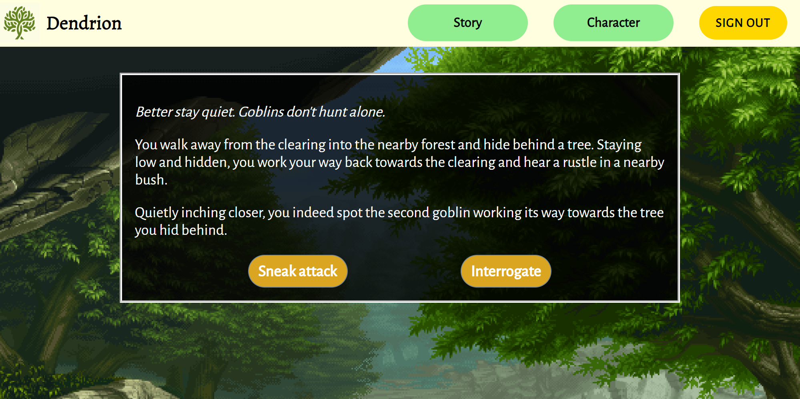
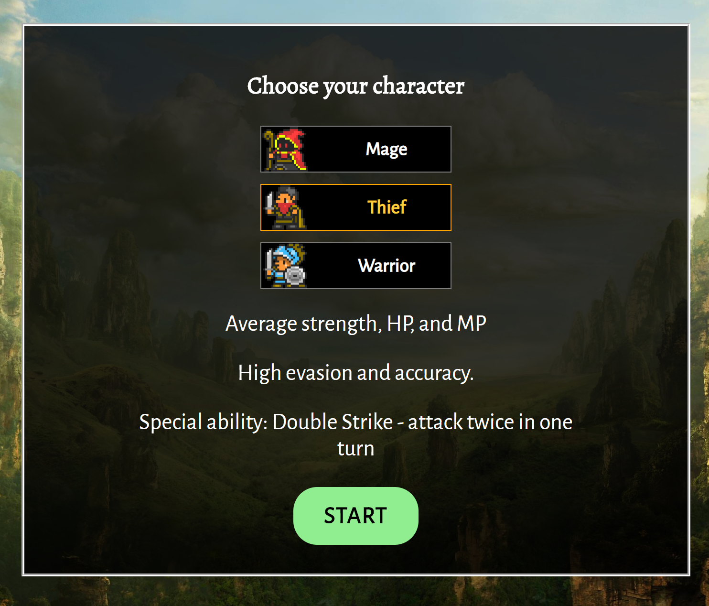

# Dendrion
## A text-based roleplaying game inspired by choose-your-own-adventure books and browser RPGs.

-----
## Live demo
https://obscure-citadel-64452.herokuapp.com/ 

-----
## Technology used
App:  
  - NodeJS
  - Express
  - MongoDB
    - mLab
    - Mongoose
  - Passport
  - bcrypt
  - JWT
  - dotenv

Tests:
  - Chai/Chai-HTTP
  - Mocha
  - TravisCI

-----

## Screenshots
### Choose your own adventure!

  

### Three playable characters with unique abilities, attributes, and skills!

 

### Battle terrifying(?) monsters!  

 

### Play on your phone!

 

### Created by Ryan Thorn for Thinkful Node Capstone (2019)